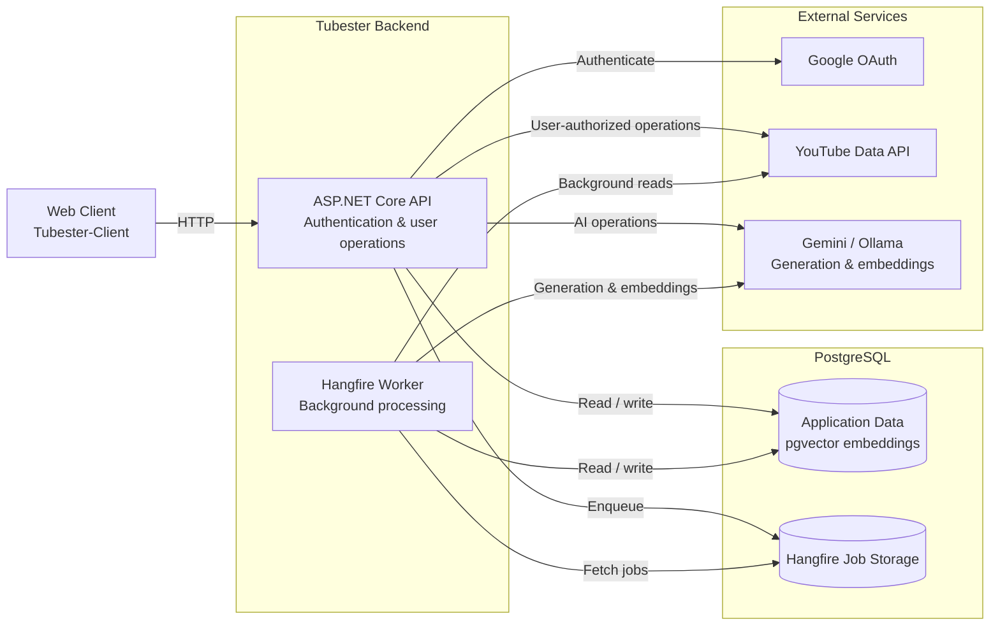
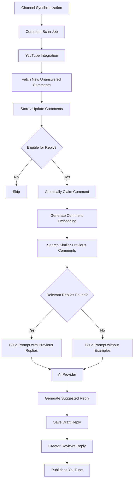
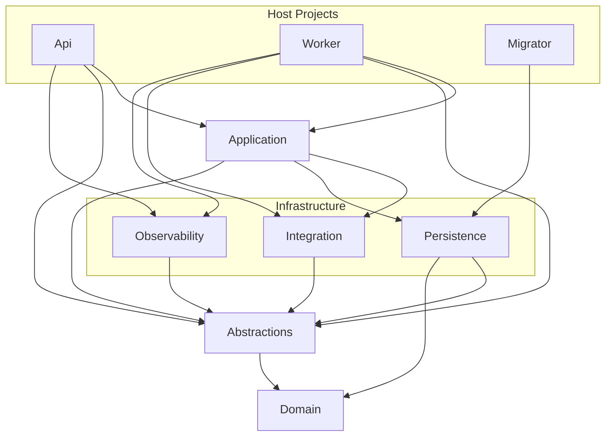

# Tubester

Tubester is a .NET 10 backend for managing YouTube video metadata, playlists, and comment replies. It combines an ASP.NET Core API, a Hangfire worker, PostgreSQL with pgvector, and AI generation through Gemini or Ollama.

## Capabilities

- Sign in with Google, with separate read and write consent for YouTube operations.
- Synchronize channels, videos, and playlists; edit metadata and save local video drafts before publishing.
- Generate video metadata and playlist suggestions using AI.
- Scan comments, generate suggested replies, and review, edit, approve, or ignore drafts.
- Store reply embeddings for relevant reply examples and support embedding backfill jobs.
- Manage account and channel settings, credits, subscriptions, and administrator-controlled application configuration.
- Expose structured logs, Prometheus metrics, health checks, and an administrator-only Hangfire dashboard.

YouTube writes require write consent. Google authentication uses online access tokens without refresh tokens, so users may need to sign in again when a token expires.

## Architecture

The API handles user requests and enqueues background work in Hangfire's PostgreSQL storage. A separate worker executes those jobs. Both hosts share application services and the same database. pgvector stores comment embeddings used to retrieve relevant approved or posted reply examples.



The API and worker expose health checks and Prometheus metrics. YouTube publishing is performed through user-authorized API operations, while background comment processing generates drafts for review.

## How reply generation works

Comment Reply Generation Flow



If no examples match, or embedding/search fails, generation proceeds without retrieved context. Comments without letters or numbers (such as emoji-only comments) skip text generation and use the channel's configured non-textual response, defaulting to `🔥🙌`. An empty or null model reply also uses that fallback.

See [CommentScanJob](Tubester.Application/Jobs/CommentScanJob.cs), [ReplyRepository](Tubester.Persistence/Replies/ReplyRepository.cs), [AiClient](Tubester.Integration/AiClient.cs), and [AiPromptBuilder](Tubester.Integration/AiPromptBuilder.cs) for the implementation.

## Repository layout

| Project / directory                                                | Responsibility                                                                               |
| ------------------------------------------------------------------ | -------------------------------------------------------------------------------------------- |
| [Tubester.Api](Tubester.Api)                                       | HTTP endpoints, Google/cookie authentication, authorization, Swagger, and Hangfire dashboard |
| [Tubester.Worker](Tubester.Worker)                                 | Hangfire job execution and recurring job registration; HTTP health and metrics endpoints     |
| [Tubester.Application](Tubester.Application)                       | Application services, jobs, credits, and domain event handlers                               |
| [Tubester.Domain](Tubester.Domain)                                 | Entities and domain events                                                                   |
| [Tubester.Abstractions](Tubester.Abstractions)                     | Shared contracts and interfaces                                                              |
| [Tubester.Persistence](Tubester.Persistence)                       | EF Core mappings, PostgreSQL repositories, and migrations                                    |
| [Tubester.Integration](Tubester.Integration)                       | YouTube, Gemini, and Ollama clients                                                          |
| [Tubester.Observability](Tubester.Observability)                   | Serilog, OpenTelemetry, and health endpoint registration                                     |
| [Tubester.Migrator](Tubester.Migrator)                             | Legacy SQLite-to-PostgreSQL data migration utility                                           |
| [tests/Tubester.IntegrationTests](tests/Tubester.IntegrationTests) | API, persistence, job, and integration tests                                                 |
| [k8s/prod](k8s/prod)                                               | Kubernetes application manifests                                                             |
| [infra/monitoring](infra/monitoring)                               | Monitoring configuration for metrics, dashboards, and log collection                         |

The API enqueues jobs. The worker executes them using the same PostgreSQL database. Run both for background features.

The worker listens on the `scanning`, `ai-templating`, `ai-playlist-suggestion`, `embeddings`, and `default` queues. The checked-in [recurring job configuration](Tubester.Worker/recurring-jobs.json) schedules daily credit-period maintenance (`0 0 * * *`).

The web client lives in the separate `Tubester-Client` repository. In Development, setting `Spa:Enabled=true` enables proxying non-API/UI-infrastructure routes to `http://localhost:5173`. The proxy is disabled by default.

In Production, the client is deployed separately.

### .NET project dependencies

The diagram below focuses on the main architectural dependency direction rather than every individual test-project reference. Arrows point from a project to a project it directly references.



Integration tests reference the host, application, persistence, integration, and domain projects as required for end-to-end and integration-level verification. Transitive dependencies and NuGet packages are omitted from the diagram.

## Local setup

Run the commands below from the solution root. Environment-variable examples use PowerShell.

### Prerequisites

- .NET 10 SDK.
- PostgreSQL with the `vector` extension available. CI uses `pgvector/pgvector:pg18`.
- Docker if using the database container below.
- Google OAuth credentials for login and a YouTube Data API key for background reads.
- Gemini credentials or a reachable Ollama server for AI features.
- The separate client and its Node.js prerequisites if using the web UI. Swagger can be used without the client.

### 1. Restore and start a development database

```powershell
dotnet restore Tubester.sln
dotnet tool install --global dotnet-ef --version 10.0.8
```

If `dotnet-ef` is already installed, use `dotnet tool update --global dotnet-ef --version 10.0.8` to align it with this repository's EF Core version.

For a local database matching the Development settings:

```powershell
docker run --name tubester-postgres -d -p 127.0.0.1:5432:5432 -e POSTGRES_DB=tubester -e POSTGRES_USER=app -e POSTGRES_PASSWORD=devpassword -v tubester-postgres-data:/var/lib/postgresql pgvector/pgvector:pg18
docker exec tubester-postgres pg_isready -U app -d tubester
```

Wait until PostgreSQL accepts connections. These credentials are for local development only. Migrations enable the `vector` extension; the database server must provide it and the migration account must have permission to create it.

### 2. Configure authentication and secrets

Both host projects already declare a `UserSecretsId`; initialization is unnecessary. Their secret stores are separate.

```powershell
dotnet user-secrets set "GoogleAuth:ClientId" "YOUR_GOOGLE_CLIENT_ID" --project Tubester.Api
dotnet user-secrets set "GoogleAuth:ClientSecret" "YOUR_GOOGLE_CLIENT_SECRET" --project Tubester.Api
dotnet user-secrets set "AdminEmails:0" "you@example.com" --project Tubester.Api
dotnet user-secrets set "YouTubeApi:ApiKey" "YOUR_YOUTUBE_API_KEY" --project Tubester.Worker
```

For a custom database, set the same connection string in both projects:

```powershell
dotnet user-secrets set "ConnectionStrings:TubesterDb" "Host=localhost;Port=5432;Database=tubester;Username=app;Password=YOUR_PASSWORD" --project Tubester.Api
dotnet user-secrets set "ConnectionStrings:TubesterDb" "Host=localhost;Port=5432;Database=tubester;Username=app;Password=YOUR_PASSWORD" --project Tubester.Worker
```

Configure the Google OAuth web application with these local redirect URIs:

```text
http://localhost:5094/api/auth/google/callback
http://localhost:5094/api/auth/google/write/callback
```

The login endpoints are `/api/auth/login/google` and `/api/auth/login/google/write`. HTTP on localhost supports local login in browsers that allow Secure cookies on localhost, such as Chrome and Firefox. Safari requires HTTPS; see the optional HTTPS setup below. For production, register the same callback paths under your public HTTPS origin.

### 3. Apply database migrations

Neither host automatically applies application migrations on startup.

```powershell
$env:ASPNETCORE_ENVIRONMENT = "Development"
dotnet ef database update --project Tubester.Persistence --startup-project Tubester.Api
```

Development selects the checked-in local connection string and loads API user secrets. For another environment, explicitly supply the target connection through `ConnectionStrings__TubesterDb`.

To create a schema migration during development:

```powershell
dotnet ef migrations add YourMigrationName --project Tubester.Persistence --startup-project Tubester.Api
```

The legacy data-copy utility is separate from EF schema migrations. See [README.migrator.md](README.migrator.md) and verify its source and destination configuration before use.

### 4. Configure AI

AI connection settings come from host configuration, but provider and generation-model selection come from the database's `ApplicationConfigurations` table. Setting `AI__Model` in the environment does not replace that database configuration.

The migrations seed `Ai:Provider=Gemini`, `Ai:Model=gemini-2.5-flash`, and `Ai:PlaylistModel=gemini-2.5-flash-lite`. For that configuration, supply the Gemini key to both hosts:

```powershell
dotnet user-secrets set "AI:Gemini:ApiKey" "YOUR_GEMINI_API_KEY" --project Tubester.Api
dotnet user-secrets set "AI:Gemini:ApiKey" "YOUR_GEMINI_API_KEY" --project Tubester.Worker
```

To use Ollama, set `Ai:Provider` to `Ollama` and select installed models for `Ai:Model` and `Ai:PlaylistModel` through the administrator API at `/api/application-configurations` (available in Swagger). Configure `AI:Ollama:Endpoint` in both hosts if it differs from `http://localhost:11434`.

Reply embeddings are stored as `vector(768)`. Configure an embedding model that returns 768 dimensions. Gemini defaults to `gemini-embedding-001` with `AI:Gemini:OutputDimensionality=768`. Ollama's fallback model is `mxbai-embed-large`; verify dimensional compatibility and explicitly set `AI:Ollama:EmbeddingModel` before using embeddings. Do not mix embeddings from different models without planning a backfill.

### 5. Run the API and worker

In separate terminals:

```powershell
dotnet run --project Tubester.Api --launch-profile http
```

```powershell
dotnet run --project Tubester.Worker --launch-profile http
```

| Service            | Local URL                                       |
| ------------------ | ----------------------------------------------- |
| Swagger UI         | `http://localhost:5094/swagger`                 |
| OpenAPI document   | `http://localhost:5094/swagger/v1/swagger.json` |
| Hangfire dashboard | `http://localhost:5094/hangfire`                |
| API readiness      | `http://localhost:5094/health/ready`            |
| Worker readiness   | `http://localhost:5095/health/ready`            |

Sign in through Swagger's Google login links. Hangfire and administrator endpoints require an email listed in `AdminEmails`.

The `http` and `https` profiles run without the SPA proxy by default, so the API can run independently of the client. To enable the web UI, start the separate client's development server on port 5173 using its own setup instructions, then run `dotnet run --project Tubester.Api --launch-profile full-stack --urls http://localhost:5094` and open `http://localhost:5094`. This profile sets `Spa__Enabled=true`; you can also enable the proxy through the `Spa:Enabled` configuration setting. The API does not launch the client automatically. The `--urls` argument overrides the full-stack profile's HTTPS address for local HTTP development.

For optional local HTTPS (required by Safari for these cookies), run `dotnet dev-certs https --trust`, then use `dotnet run --project Tubester.Api --launch-profile https`, or the `full-stack` profile without the `--urls` override. Open `https://localhost:5094` and register both Google callback URIs above with `https://` instead of `http://`. See [MDN's cookie documentation](https://developer.mozilla.org/en-US/docs/Web/HTTP/Guides/Cookies) for the localhost exception.

Development settings disable Serilog in both hosts, preserving standard .NET logging configured through the `Logging` section. To enable Serilog locally, set `Serilog:Enabled=true` in each host's user secrets. This also enables the configured Seq sink at `http://localhost:5341`; set `Observability:Seq:Enabled=false` if you only want console logs.

## Configuration reference

Use user secrets for local credentials and environment variables or an external secret store for production. Standard .NET environment configuration uses `__` in place of `:`. Production connection strings are empty in the checked-in settings and must be supplied.

| Environment variable                                             | Applies to              | Purpose                                                          |
| ---------------------------------------------------------------- | ----------------------- | ---------------------------------------------------------------- |
| `ConnectionStrings__TubesterDb`                                  | API, worker, migrations | PostgreSQL connection string, shared by EF Core and Hangfire     |
| `GoogleAuth__ClientId`, `GoogleAuth__ClientSecret`               | API                     | Google OAuth web client credentials                              |
| `YouTubeApi__ApiKey`                                             | Worker                  | YouTube background API reads                                     |
| `AdminEmails__0`, `AdminEmails__1`, …                            | API                     | Administrator email allowlist                                    |
| `AI__Gemini__ApiKey`                                             | API, worker             | Gemini credential                                                |
| `AI__Gemini__EmbeddingModel`, `AI__Gemini__OutputDimensionality` | API, worker             | Gemini embedding configuration; dimensions must match the schema |
| `AI__Ollama__Endpoint`                                           | API, worker             | Ollama base URL reachable from each process/container            |
| `AI__Ollama__EmbeddingModel`                                     | API, worker             | Ollama embedding model                                           |
| `ASPNETCORE_URLS`                                                | API, worker             | Listening addresses; containers use `http://+:8080`              |
| `ASPNETCORE_ENVIRONMENT`, `DOTNET_ENVIRONMENT`                   | API, worker             | Set both to `Production` in deployment                           |
| `Observability__Enabled`, `Observability__Prometheus__Enabled`   | API, worker             | Enable metrics instrumentation/export                            |
| `Observability__Seq__Enabled`, `Observability__Seq__Url`         | API, worker             | Optional Seq sink                                                |

See [application configuration keys](Tubester.Abstractions/ApplicationConfiguration/ApplicationConfigurationKeys.cs) for database-controlled AI generation settings, including temperature and per-operation token limits.

## Tests

Tests use a real PostgreSQL database with pgvector. They do not provision it. Most external integrations are mocked, and developer-only live AI tests are marked skipped.

**Use a dedicated disposable database.** Test cleanup truncates tables in the `public` and `analytics` schemas. Never point tests at development data you need to retain or at production.

For the local container above, create a separate database once and run the suite:

```powershell
docker exec tubester-postgres createdb -U app tubester_test
$env:ConnectionStrings__TubesterDb = "Host=localhost;Port=5432;Database=tubester_test;Username=app;Password=devpassword"
$env:Tubester_INTEGRATIONTESTS_CONNECTION_STRING = $env:ConnectionStrings__TubesterDb
dotnet ef database update --project Tubester.Persistence --startup-project Tubester.Api
dotnet build Tubester.sln --configuration Release
dotnet test Tubester.sln --no-build --configuration Release
Remove-Item Env:ConnectionStrings__TubesterDb
Remove-Item Env:Tubester_INTEGRATIONTESTS_CONNECTION_STRING
```

Both connection variables are set so host services and test DbContext overrides target the same database. Remove them before starting the application again. The [CI workflow](.github/workflows/ci.yaml) restores, builds, migrates a pgvector database, and runs tests for pull requests targeting `main`.

## Production deployment

### Images and delivery

Build from the solution root so Docker can access all referenced projects:

```powershell
docker build -f Tubester.Api/Dockerfile -t tubester-api:local .
docker build -f Tubester.Worker/Dockerfile -t tubester-worker:local .
```

Both images listen on port 8080 and run as the .NET image's non-root user. The API image also contains `./efbundle` for applying migrations. The client image is built outside this repository.

The [backend delivery workflow](.github/workflows/cd.yaml) runs on pushes to `main` or manual dispatch. It publishes API and worker images to GHCR with `sha-<commit>` and `latest` tags, runs the migration bundle from the commit-tagged API image, then deploys and waits for API/worker rollouts. It requires the GitHub `production` environment secrets `PROD_HOST`, `PROD_USER`, and `PROD_SSH_KEY`, plus server-side Kubernetes access. It does not run the test suite itself.

### Kubernetes prerequisites and rollout

The [production manifests](k8s/prod/kustomization.yaml) target k3s with its bundled Traefik ingress. Application resources use the `tubester` namespace; ServiceMonitors use an existing `monitoring` namespace and require Prometheus Operator CRDs.

Before deployment:

1. Provision PostgreSQL with pgvector, backups, and database credentials. The manifests do not provision PostgreSQL or AI services.
2. Configure DNS, HTTPS, and Traefik's `letsencrypt` certificate resolver. Replace `tubester.app` in [ingress.yaml](k8s/prod/ingress.yaml) for another domain and register matching Google callback URLs.
3. Create the namespace with `kubectl apply -f k8s/prod/namespace.yaml`. Provision `tubester-api-secrets` and the GHCR pull secret `ghcr-secret` through your secret-management process.
4. Use [secret.example.yaml](k8s/prod/secret.example.yaml) only as a structural template. Its `Hangfire__AdminEmails__0` entry is stale: use `AdminEmails__0`. Add the AI connection settings required by the selected provider. Both hosts consume `tubester-api-secrets`; never commit populated secrets.
5. Select matching immutable API/worker image tags and the intended client image. Checked-in deployment manifests use `latest`; the backend workflow subsequently sets commit-specific API/worker images.
6. Back up the database and run migrations from the release's API image before rolling out the hosts. Review compatibility with running instances. The [migration job](k8s/prod/db-migration.job.yaml) is separate from Kustomize and requires its image to be set to the release being deployed.
7. Review `kubectl kustomize k8s/prod`, apply the configured manifests, and verify rollout status, readiness, Google login, and a queued job completing on the worker.

`kubectl apply -k k8s/prod` does not create secrets or run migrations. The [rollback job](k8s/prod/db-migration-rollback.job.yaml) contains a historical image and migration target; it is not a ready-to-run rollback for an arbitrary release. Choose and review the target explicitly, including possible data loss. Rolling back application images does not roll back the database.

### Runtime considerations

- Keep the API behind a trusted proxy and restrict direct access. Its forwarded-header configuration clears the trusted proxy/network lists, accepting forwarded headers from any reachable peer.
- Persist and share ASP.NET Core Data Protection keys before relying on sessions across container restarts or multiple API replicas. The checked-in deployment has no persistent key volume or external key-store configuration.
- Swagger is enabled in all environments, and the supplied ingress exposes `/swagger`. Restrict that route at the edge if it should not be public.
- `AdminEmails` controls administrator endpoints and Hangfire. The `GoogleAuth` allowlist fields present in settings are not enforced by the current Google authentication registration.
- Keep health and metrics access internal. `Observability:Prometheus:ExposePublicly` is not consulted by endpoint mapping and does not provide access control.

## Operations and observability

| Endpoint        | Hosts          | Behavior                                                        |
| --------------- | -------------- | --------------------------------------------------------------- |
| `/health/live`  | API and worker | Lightweight process self-check                                  |
| `/health/ready` | API and worker | PostgreSQL connectivity check                                   |
| `/metrics`      | API and worker | Prometheus export when observability and Prometheus are enabled |
| `/hangfire`     | API            | Administrator-only job dashboard                                |

Readiness does not validate the application schema, Hangfire job execution, YouTube, or AI availability. Kubernetes probes use port 8080; local launch profiles use API port 5094 and worker port 5095. Configure listening ports through ASP.NET Core hosting settings, not `Observability:WorkerHttpPort`.

Serilog is enabled by default, with compact JSON console output in the base settings and optional Seq delivery. Development overrides `Serilog:Enabled` to `false` and uses standard .NET logging. Set `Serilog__Enabled` to override this behavior through the environment. Metrics configuration is independent of this switch.

Metrics include custom job/YouTube/AI counters and HTTP-client, runtime, and process instrumentation; the API additionally enables ASP.NET Core instrumentation. Scrape both processes because metrics are process-local. Metric definitions are in [TubesterMetrics.cs](Tubester.Observability/TubesterMetrics.cs).

`BusinessMetricsRefreshService` exists but is not registered by either host, so periodically refreshed user/channel/video/reply totals are not active. Changing `BusinessMetrics:RefreshIntervalSeconds` alone does not activate the service.

Monitoring deployment values are in [infra/monitoring](infra/monitoring), with deployment automation in [cd-infra.yml](.github/workflows/cd-infra.yml). A local observability Docker Compose stack and provisioned Grafana overview dashboard are not included.

## Troubleshooting

| Symptom                                        | Check                                                                                                                                                              |
| ---------------------------------------------- | ------------------------------------------------------------------------------------------------------------------------------------------------------------------ |
| Startup reports a missing connection string    | Set `ConnectionStrings:TubesterDb` for each host; confirm the selected environment                                                                                 |
| Migration cannot create `vector`               | Use PostgreSQL with pgvector installed and an account allowed to create the extension                                                                              |
| Google login fails or loops                    | Check matching callback URIs (including scheme and port) and `GoogleAuth` credentials; use optional HTTPS if your browser rejects Secure cookies on HTTP localhost |
| Administrator endpoint or Hangfire returns 403 | Set top-level `AdminEmails` to the signed-in email; do not use `Hangfire:AdminEmails`                                                                              |
| Background jobs remain queued                  | Run the worker against the same database and inspect its logs and Hangfire queues                                                                                  |
| AI generation fails                            | Check database provider/model selection, provider credentials, and network reachability from the executing host                                                    |
| Embedding persistence fails                    | Ensure the embedding model returns 768 dimensions                                                                                                                  |
| Development root page returns a proxy error    | Start the client on port 5173, or disable `Spa:Enabled` for API-only development                                                                                   |
| Development root page returns 404              | Expected with the SPA proxy disabled; use `/swagger` or enable the `full-stack` launch profile with the client running                                             |
